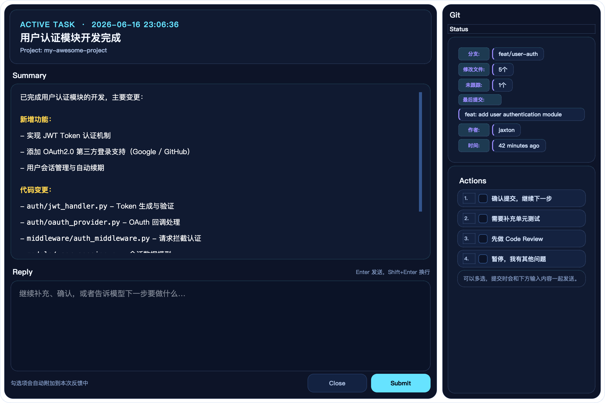
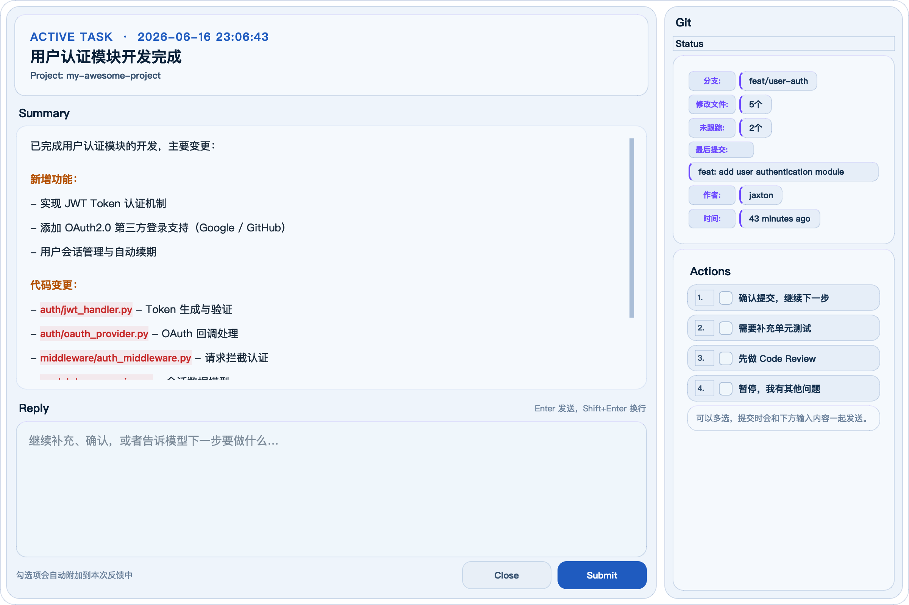

# Interactive Feedback MCP

**让 AI Agent 在执行任务时暂停并弹窗询问你，而不是猜测着往下做。**

**Make your AI Agent pause and ask you, instead of guessing.**

Tool calls don't consume API credits — you can interact with the AI multiple times within a single request.

## 界面预览 / UI Preview

支持亮色 / 暗色双主题，自动跟随系统设置，`Ctrl+T` 手动切换。

Dual-theme support (light/dark), auto-follows system settings, toggle with `Ctrl+T`.

| Dark | Light |
|:---:|:---:|
|  |  |

**Features:**
- Three-column layout: AI summary + reply area + Git status & quick actions
- Glassmorphism adaptive theme (sci-fi dark / clean light)
- Markdown rendering + syntax highlighting
- Image paste support (screenshot → `Ctrl+V`)
- Predefined options for one-click selection
- Real-time Git branch / modified files / recent commit display

## 快速安装 / Quick Start

### Prerequisites

- Python 3.10+
- [uv](https://docs.astral.sh/uv/)

```bash
# Install uv (if not installed)
curl -LsSf https://astral.sh/uv/install.sh | sh
```

### Install

```bash
git clone https://github.com/jaxtonzhc/interactive-feedback-mcp.git ~/.interactive-feedback-mcp
cd ~/.interactive-feedback-mcp && uv sync
```

## 配置 / Configuration

### 1. MCP Config

Add to `~/.cursor/mcp.json` (global) or `.cursor/mcp.json` (project):

```json
{
  "mcpServers": {
    "interactive-feedback": {
      "command": "uv",
      "args": [
        "--directory",
        "/absolute/path/to/.interactive-feedback-mcp",
        "run",
        "server.py"
      ],
      "timeout": 600,
      "autoApprove": ["interactive_feedback"]
    }
  }
}
```

> Replace `/absolute/path/to/.interactive-feedback-mcp` with your actual install path.

### 2. AI Rule

Add to Cursor Settings → Rules for AI:

```
After completing a task, you MUST call the interactive_feedback tool to confirm the result and ask for follow-up instructions.
Never end a reply without calling interactive_feedback.
Provide predefined_options for quick selection.
Only stop calling when the user explicitly chooses "Done".
```

## 一键安装 / Copy-Paste Install for Your Agent

Paste this to your AI Agent and it will set everything up:

> Install interactive-feedback-mcp:
> 1. Run `git clone https://github.com/jaxtonzhc/interactive-feedback-mcp.git ~/.interactive-feedback-mcp && cd ~/.interactive-feedback-mcp && uv sync`
> 2. Add to `~/.cursor/mcp.json`: command=uv, args=`["--directory", "<absolute path to ~/.interactive-feedback-mcp>", "run", "server.py"]`, timeout=600, autoApprove=`["interactive_feedback"]`
> 3. Add AI rule: Always call interactive_feedback after completing tasks. Provide predefined options. Only stop when user says Done.

## 工作原理 / How It Works

```
You send task → Agent works → Popup waits for feedback → You add instructions → Agent continues → ... → Type "Done" to finish
```

Agent calls `interactive_feedback` → `server.py` spawns PySide6 GUI → popup window appears → user enters feedback → writes temp JSON → returns to Agent.

Built-in heartbeat prevents Cursor timeout. Anti-duplicate logic prevents multiple popups.

## 项目结构 / Project Structure

```
server.py                  # MCP server (FastMCP + heartbeat + anti-duplicate)
enhanced_feedback_ui.py    # GUI entry (PySide6 three-column layout)
pyproject.toml             # Deps: fastmcp, pyside6, psutil, markdown, pygments
ui/
├── components/            # Layout, Markdown renderer, data visualization
├── styles/                # Glassmorphism themes (dark / light)
├── utils/                 # Logging, performance, config, responsive layout
├── widgets/               # Custom text editor (image paste support)
└── resources/             # Icon management
```

## License

[MIT License](LICENSE)
